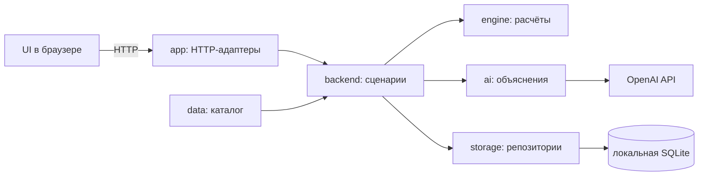

# Архитектура локального приложения

Статус: документированный каркас; код модулей ещё не реализован. Текущий этап — в [plans.md](../../plans.md).

## Запуск и поток данных

Один локальный процесс Next.js обслуживает браузер и HTTP API на 127.0.0.1. Backend обращается к OpenAI через серверный SDK; SQLite размещается на том же компьютере. Без OpenAI остаётся симуляция и шаблонный текст. Публикация в облако не требуется.

UI может применять engine для предварительного результата, используя публичный датасет. Это та же реализация математики, а не отдельная формула. Сервер получает исходный выбор и повторно проверяет его. AI получает только этот доверенный отчёт.

## Разрешённые зависимости

| Модуль | Допустимые модули проекта | Граница |
| --- | --- | --- |
| contracts | нет | Только типы и схемы, без I/O и окружения |
| data | contracts | Синтетический набор, версии; без чтения секретов |
| engine | contracts | Все данные передаются аргументами; без сети/БД |
| config | нет | Чтение и проверка серверного env |
| ai | contracts | Получает настройки/отчёт аргументами, обращается к OpenAI; не пишет в storage |
| storage | contracts | Получает путь БД аргументом; SQL/миграции внутри адаптера |
| backend | contracts, data, engine, ai, storage, config | Серверная координация и проверка доверенных данных |
| ui | contracts, engine, data, mocks | engine/data только для предварительного расчёта; mocks только в прототипе |
| app | ui, backend, contracts | Клиентские страницы не импортируют backend; backend доступен только серверным адаптерам |
| mocks | contracts, data | Не используются реальными API вместо вычислений |

Внешние библиотеки по роли разрешены: React в UI, Zod в схемах/config, OpenAI SDK в ai, SQLite-драйвер в storage. Backend передаёт проверенную конфигурацию адаптерам. Тесты могут использовать фикстуры и временную БД.

После появления кода каждый модуль экспортирует публичный интерфейс через index.ts. Импорты внутренних файлов другого модуля и циклы запрещены; проверка линтером вводится на P1. Нельзя делать общий barrel, который смешивает клиентские и серверные экспорты. backend/ai/storage/config защищаются server-only.

## Состояние и ожидание AI

UI отвечает за черновик и состояние экрана, engine — за значения, backend — за доверенный отчёт и привязку анализа к сценарию, storage — за сохранение. OpenAI запускается после явного запроса анализа; переключение карточек само по себе не порождает платный запрос.

Пользователь может изменить выбор во время ожидания. Ответ старого анализа не заменяет отчёт нового портфеля. На P5 локальное ожидание после перезапуска может быть потеряно; повторный платный запрос не запускается автоматически. На P6 сохраняются результаты и метаданные версии. Схема API подробно описана в plans.md и уточняется при реализации, сейчас endpoints отсутствуют.

## Документация и развитие

Каждый README модуля описывает назначение, планируемую структуру, интерфейс, зависимости и проверки. Персональные исполнители ещё не назначены; ответственность задаётся модулем, а не выдуманным владельцем. [Прежние командные роли](../team-roles.md) сохранены как история.

Границы позволяют позже выделить сервер или заменить хранилище без переноса формулы в UI. Независимое масштабирование процессов не заявляется: сейчас принято одно локальное приложение. Решение о сервисах принимается при появлении реальной потребности и записывается в журнал plans.md.
