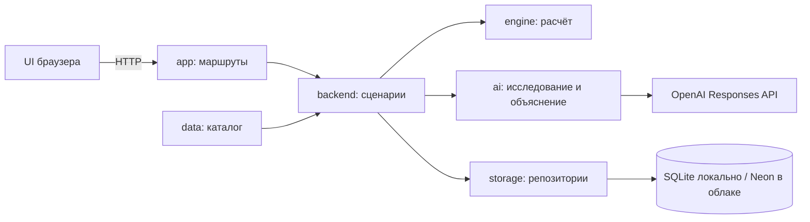

# Архитектура приложения

## Netlify + Neon

Облачный режим Netlify + Neon: UI → Next.js API → backend → Neon; POST анализа также запускает netlify/functions/analysis-background.ts. Worker → защищённый POST /api/internal/analyses/:id → pollAnalysis. Браузер читает статус независимо от worker. Дополнительные публичные входы backend/dispatch.ts и backend/worker-auth.ts нужны для HTTP-адаптера и standalone worker. На Netlify локальная SQLite не используется. Подробности и ограничения: [публикация](../deployment.md).

Реализован модульный монолит: Next.js, браузерный UI, отдельный расчётный движок, хранилище и внешний OpenAI API. Локально используется SQLite; для Netlify подготовлен Neon PostgreSQL. Текущее состояние — в [plans.md](../../plans.md).

## Границы

| Модуль | Зависимости проекта | Интерфейс |
| --- | --- | --- |
| contracts | нет | Типы и строгие Zod-схемы |
| data | contracts | dataset, categories, exampleSelections, scenarioInput |
| engine | contracts | validate, simulate, baseline, canonicalSelections; данные аргументами |
| config | нет | getConfig, server-only |
| ai | contracts | createAI, extractSources, verifyExplanation, fallback |
| storage | contracts | createStorage(path), createPostgresStorage; репозитории сценариев и анализов |
| backend | contracts, data, engine, ai, storage, config | simulate/save/list/load, start/poll/cancelAnalysis |
| ui | contracts, data, engine | CitySimulator; локальный preview и HTTP-клиент |
| app | ui, backend | Next.js страницы и Route Handlers |

Публичный вход каждого исполняемого модуля — index.ts, кроме Next.js app с файловой маршрутизацией. UI не импортирует серверные модули; engine не использует React, сеть, БД или env. Защита — server-only и ограничения ESLint. Циклы и обход границ через относительные импорты запрещены правилами проекта; линтер не является полным анализатором графа зависимостей.

## HTTP API

| Метод и маршрут | Вход / результат |
| --- | --- |
| POST /api/simulate | ScenarioInput + mode preview/final → серверный ScenarioReport |
| POST /api/scenarios | ScenarioInput + name + необязательный analysisId → сохранённый финальный отчёт |
| GET /api/scenarios | До 100 последних сценариев |
| GET /api/scenarios/:id | Сценарий или 404 |
| POST /api/analyses | AnalysisRequest → AnalysisView с локальным ID |
| GET /api/analyses/:id | Статус и объяснение; локально также продвижение этапа |
| DELETE /api/analyses/:id | Отмена ожидания и попытка остановить OpenAI response |
| POST /api/internal/analyses/:id | Продвижение облачной задачи; требуется служебный секрет |
| GET /api/status | Наличие настройки AI, модель и версии; без ключа |

Входные схемы находятся в [contracts](../../src/contracts/index.ts). Клиент передаёт IDs мер/районов и версии, сервер сам определяет цены, эффекты и Score. Ошибки имеют `{error, details?}` и HTTP 400/403/404/409/413/415/429/500. Для preview неполного набора score/delta равны null. Серверная проверка Origin/Host/JSON защищает локальные операции записи от обычных межсайтовых запросов; это не система аккаунтов или публичный API.

## Данные и ожидание

UI хранит черновик в localStorage. SQLite в режиме WAL хранит scenarios и analyses; начальная миграция — user_version 1. AnalysisJob содержит запрос, серверный отчёт, состояние двух этапов, provider ID, источники, токены, модель и версии. Браузеру provider ID не выдаётся.

AI запускается по отправке вопроса или кнопке итогового анализа. Изменение портфеля пересчитывает preview без нового AI-запроса. Новый ход отменяет старую задачу. Дубликат requestId с тем же нормализованным содержанием возвращает существующую запись, с другим — HTTP 409. Запись резервируется до ожидания отмены предыдущего запроса; автоматических retries SDK нет. Poll использует SQLite lease на 90 секунд, чтобы не запускать один переход параллельно. Перед созданием второго response сохраняется отметка перехода; прерванный запуск не повторяется автоматически. Готовый ответ привязан к canonicalSelections и поколению запросов UI, поэтому не заменяет другой портфель.

Исследование → проверенные ID цитат → структурированное объяснение. Локально переход запускается опросом из браузера; в Netlify — защищённым вызовом worker. При длительной паузе и истечении трёх минут новый платный этап не начинается; уже завершённое финальное объяснение можно получить позже. Две платные генерации не образуют транзакцию с локальной SQLite: в редком сбое между приёмом запроса OpenAI и записью его ID приложение покажет прерванный запуск, а исходная генерация может быть оплачена.

## Развитие

Границы позволяют заменять UI, AI-адаптер или хранилище без изменения движка. Общая PostgreSQL БД и фоновый worker реализованы для облачного режима, но живая публикация ещё требует проверки. Аккаунты и разграничение доступа не реализованы. Их добавляют по реальным требованиям. [Исторические роли команды](../archive/team-roles.md) сохранены отдельно от действующих инструкций.
